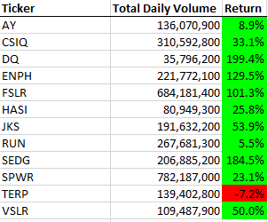
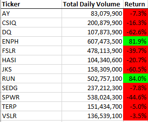
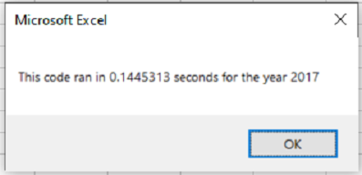
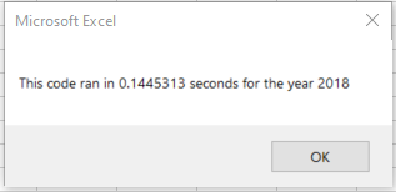

# VBA of Wallstreet

## Overview of Project

### Purpose
This project's goal was to take the VBA code that was satisfactory for a small amount of tickers and refactor it so that it runs faster and more efficiently so that Steve can run the same script for thousands of stocks, giving him and his parents a better overall image of what stocks to invest in.

## Method and Challenges

### Method Used to Achieve Goals
We used a portion of the existing code as a skeleton for the refactoring. We then thought about how we could make the script run faster. Using the hints and guides, we were able to understand that the simplest way would be to eliminate one of the for statements in the nested for statements. This would make decrease the amount of steps for each loop. We did this by creating a variable for the index and created arrays for the outputs that would reference index variable. Simply put, when the for loop was ran, it gathered the outputs for each ticker so that we only had to run through all the rows once instead of 12 times like our original code.

### Challenges and Difficulties Encountered
It took us a few frustrated hours and a night of sleep before we were able to get on the right path. Originally, we tried using the "tickerIndex" variable for only the ticker. We were esentially just reinventing the wheel instead of ataching an engine to it. After clearing our code and starting over, looking at the ticker and output arrays as a matrix, it was a lot easier to piece the solution together and make a lot more sense of how to manipulate the code to achieve the goal. 

## Results

### Compare the Stock Performance between 2017 and 2018
The first objective that Steve wanted us to do, was to come up with code so that we could easily look at the performance of each stock. If we had just looked at one year, we might have not have gotten a clear enough picture so we wrote the following code so that we could easily choose between the two different data sets we had for 2017 and 2018 respectively:

    yearValue = InputBox("What year would you like to run the analysis on?")
    Range("A1").Value = "All Stocks (" + yearValue + ")"

By using this code, we could run different years by using the same subroutine. It can be seen that most of the stocks in 2017 outperfored the stocks the following year. The only stock that grew by a significant amount in both years was ENPH. 

Steve and his parents may want to go over more stocks and add more years to the data set so we can get a broader picture of what is going on with the market.

### Compare Original Script with Refactored Script

From an efficacy and processing speed perspective, the refactored code greatly outperformed the orginal by an almost 6 to 1 margin. The refactored script took less than a fifth of a second on average to complete where as the original script ran in just above four-fifths of a second on average. As stated above, this occured by eliminating a for statement and creating an index variable, making it so that it didnt have to run the same script twelve times.

    Dim tickerIndex As Integer
    tickerIndex = 0
    Dim tickerVolumes(11) As Long
    Dim startingPrices(11) As Single
    Dim endingPrices(11) As Single	

    For i = 2 To RowCount
        
	If Cells(i - 1, 1).Value <> tickers(tickerIndex) And Cells(i, 1).Value = tickers(tickerIndex) Then
	startingPrices(tickerIndex) = Cells(i, 6).Value

	ElseIf Cells(i + 1, 1).Value <> tickers(tickerIndex) And Cells(i, 1).Value = tickers(tickerIndex) Then  
	endingPrices(tickerIndex) = Cells(i, 6).Value

     End If

## Summary

### What are the advantages or disadvantages of refactoring?
Refactoring your code can increase the efficiency and speed of your script by augmentation, reducing the ammount of unnecessary code and automation. But in doing this, we run the risk of over engineering our code or corrupting our original code. Refactoring code also takes time and could be more exhaustive than the time and effort that efficiency yeilds.

### How do these pros and cons apply to refactoring the original VBA script?
With this script in particular, there was a lot of time spent and energy spent for three-fifths a second saved per run. However, if Steve does infact use this code to run on a larger data sets that includes thousands of tickers and possibly several more years woth of data, then the efficiency could be useful in saving time and processing power needed to run the script.
